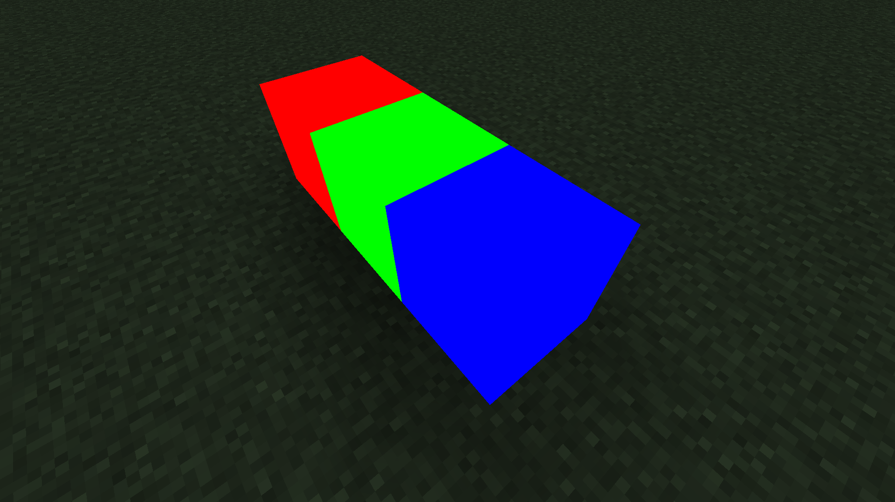
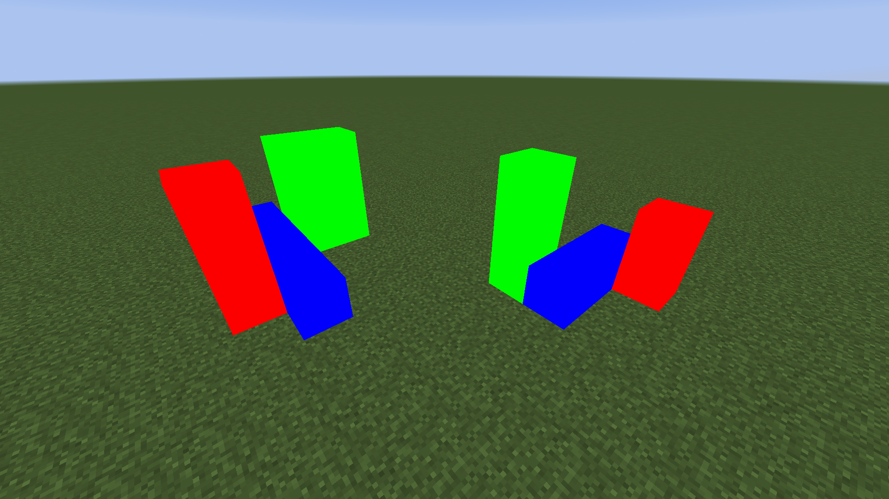
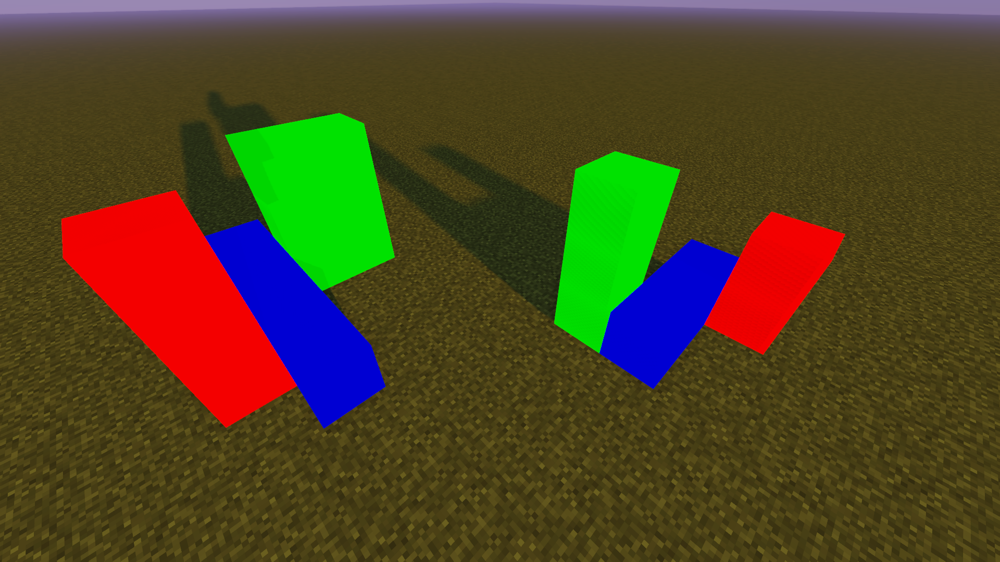
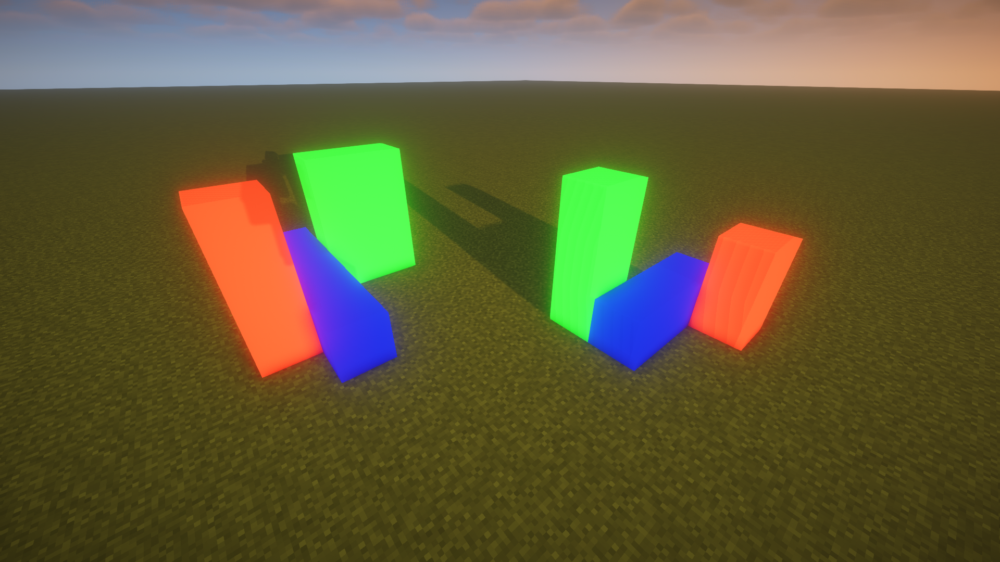
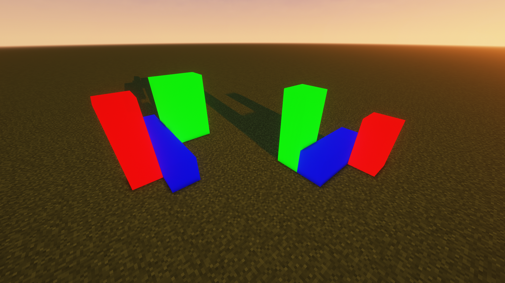

English | [简体中文](README_CN.md)

# ChromaticityBlock

This mod adds chromaticity block, whose rendering is not affected by lighting, making it particularly suitable for convenient chromaticity cutouts.

In addition to the commonly used colors in creative tab, you can get any color through NBT.

## How to Use

**Method One**: Use the common colors built into the creative mode item bar directly.

**Method Two**: Obtain chromaticity blocks of any color by adding them through NBT.

## Commands to Get Chromaticity Blocks of Any Color

> The common colors built into the creative mode item bar should generally meet your needs. If you want to customize colors, you will need to use commands to get chromaticity blocks of any color.

- ### Before MC 1.13 Version

`give @s chromaticityblock:chromaticity_block 1 0 {"BlockEntityTag":{"color":-1}}`

`setblock ~ ~ ~ chromaticityblock:chromaticity_block 0 normal {"color":-1}`

- ### After MC 1.13 Version

`give @s chromaticityblock:chromaticity_block{"BlockEntityTag":{"color":-1}}`

`setblock ~ ~ ~ chromaticityblock:chromaticity_block{"color":-1}`

## Color Parameter

The color of the chromaticity block is determined by color NBT.

Any color can be obtained by mixing red, green, and blue, so to confirm a color, you only need four argb parameters, which are alpha, red, green, and blue.

For example, the hexadecimal color value FF4488CC contains four argb parameters. FF is alpha, 44 is red, 88 is green, CC is blue, and the range of these four parameters is 0-255 (corresponding to hexadecimal 0-FF).

> It should be noted that although alpha can be stored in the number, there is actually no transparency effect in this mod.

Unfortunately, integers in NBT cannot be input in HEX, so you need to convert to DEC.

You can use the calculator that comes with Windows to complete this conversion. Use the programmer mode, set the mode to DWORLD, enter the value in HEX, and you can see this value in DEC.

## compatibility

- **1.12.2 - forge - Optifine**

  Not fully compatible. Optifine can be added, but this mod not compatible with any shader. If you try to use a shader, chromaticity block will have serious rendering errors.

- **1.16.5 - fabric - Sodium - Iris**

  Compatibility. Although using shader may have some minor issues, there are no serious rendering errors. Here are some common shadow effects:

  - Sildurs_v1.26

  

  - BSL_v8.2.08

  

  - ComplementaryShaders_v4.4

  

- **1.20.4 - fabric - Sodium - Iris**

  same as 1.16.5 - fabric - Sodium - Iris

## About

- Author: Yancey

- QQ: 1709185482

- Email: 1709185482@qq.com

- GitHub:  
  <https://github.com/Yancey666/ChromaticityBlock>  
  <https://github.com/Yancey666/ChromaticityBlock-forge>

## Special Thanks

-  JetBrains open source programs supporting

