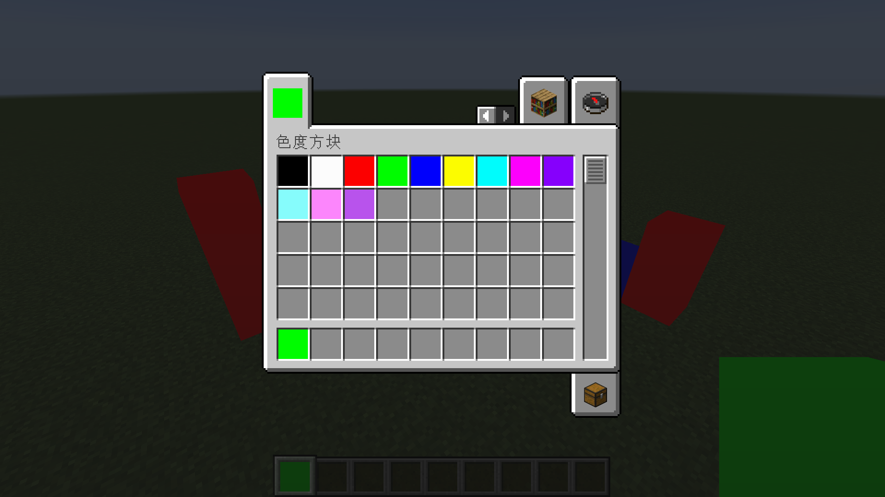

[English](README.md) | 简体中文

# ChromaticityBlock - 色度方块

这个模组添加了色度方块，它的渲染不会收到光照的影响，特别适合方便色度抠图。

支持的MC版本：`1.12.2-forge`，`1.16.5-fabric`，`1.20.4-fabric`

## 使用方法

**方式一**：直接使用创造模式物品栏内置了的常用颜色

**方式二**：通过NBT添加获得任意颜色的色度方块

## 使用命令获取任意颜色的色度方块

> 创造模式物品栏内置了的常用颜色一般能够满足你的需求，如果你想要自定义颜色才需要使用命令获取任意颜色的色度方块

- ### MC 1.13版本前

`give @s chromaticityblock:chromaticity_block 1 0 {"BlockEntityTag":{"color":-1}}`

`setblock ~ ~ ~ chromaticityblock:chromaticity_block 0 normal {"color":-1}`

- ### MC 1.13版本后

`give @s chromaticityblock:chromaticity_block{"BlockEntityTag":{"color":-1}}`

`setblock ~ ~ ~ chromaticityblock:chromaticity_block{"color":-1}`

## color参数

色度方块的颜色是通过color这个NBT决定的

任何一种颜色都可以通过红绿蓝三种颜色混合得到，所以确认一种颜色只需要argb四个参数，他们分别是分别是alpha(透明度), red(红色强度), green(绿色强度) , blue(蓝色强度)。

比如FF4488CC这个16进制的颜色数值，包含了argb四个参数。其中FF是alpha，44是red，88是green，CC是blue，这4个参数的范围都是0-255（对应16进制的0-FF）。

> 需要说明的是，虽然数值中存储了alpha，但是实际上在本模组并不会有透明效果

很遗憾，NBT中的整数不能输入HEX，因此你需要转换为DEC

你可以使用Windows自带的计算器完成这个转换，使用程序员模式，模式设置为DWORLD，在HEX中输入数值，就可以在DEC中看到这个数值

## 兼容性

- **1.12.2 - forge - Optifine**

  不完全兼容，可以加Optifine，但是不兼容任何光影。如果加了光影，否则色度方块会有严重的渲染错误。

- **1.16.5 - fabric - Sodium - Iris**

  兼容。虽然加上光影会有一些小问题，但是没有严重的渲染错误。以下是一些常用光影的效果：

  - Sildurs_v1.26

  

  - BSL_v8.2.08

  

  - ComplementaryShaders_v4.4

  

- **1.20.4 - fabric - Sodium - Iris**

  效果与1.16.5 - fabric - Sodium - Iris一样

## 关于

- 作者：Yancey

- QQ：1709185482

- 邮箱：1709185482@qq.com

- GitHub：  
  <https://github.com/Yancey666/ChromaticityBlock>  
  <https://github.com/Yancey666/ChromaticityBlock-forge>

## 特别感谢

- 感谢JetBrains对开源程序的支持

